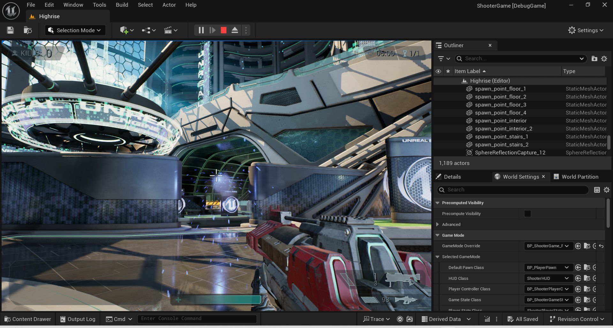
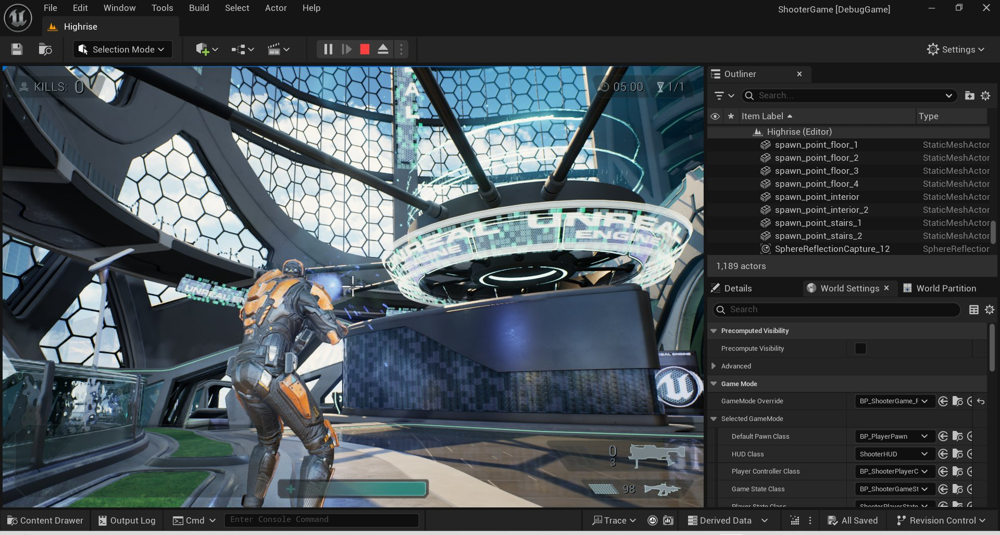
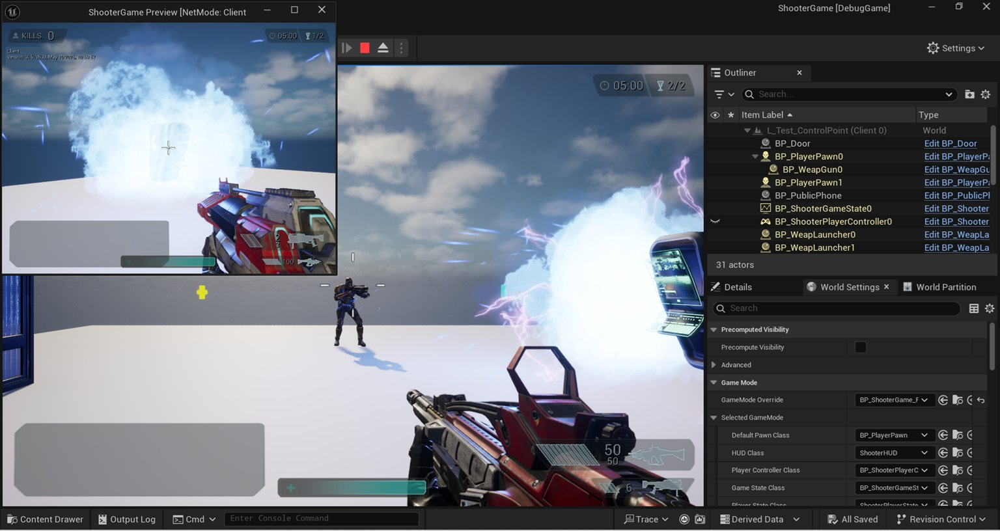
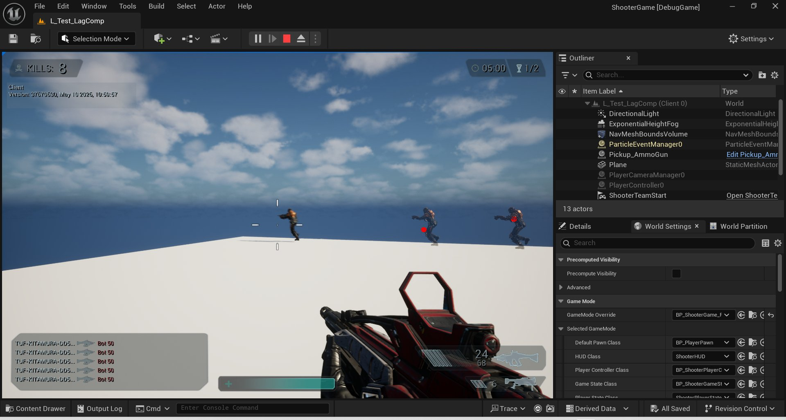
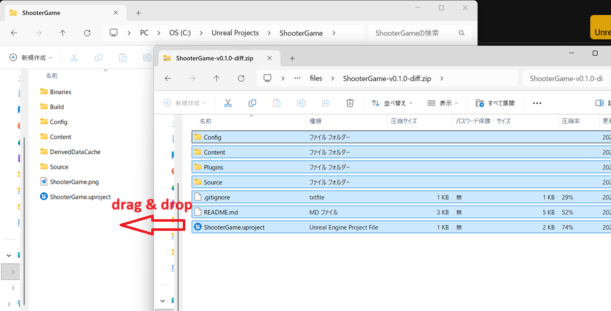
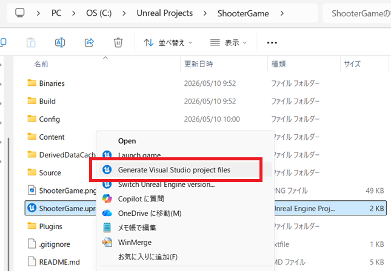
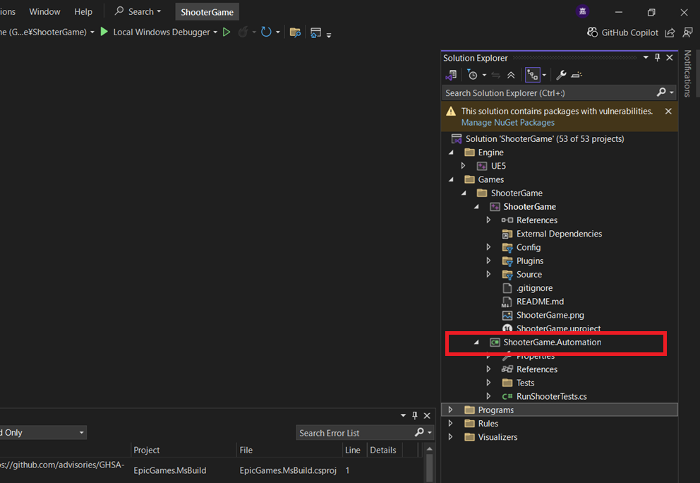

# ShooterGame Cusomized Version

## Overviews

Regarding the project structure, the CrossplayShooter plugin was added as core module and integrated into ShooterGame.
The CrossplayShooter plugin provides basic functionality for crossplay, including FPS, TPS and VR and its features are planned to be expanded in the future.

## Features

The following architectures and features have been added or modified to ShooterGame:

|Architectures / Feature	|Description|
|---		|---|
|GAS-based Architecture	|Migrated the entire ShootGame to the Gameplay Ability System (GAS) based.|
|Player Perspective Switching	|Switching FPS/TPS player perspectives. Toggle with the "T" key.|
|Lag Compensation	|Instant Weapon: Confirm hit result on client by on server. Can show character's pose and impact point at the moment of hit on server to client side for debug. Projectile weapon: Synchonize launched projectile location on client and server.|
|Interaction with Other Actors	|Interacting with actors on level (like doors, control points, etc.).|
|Damage Text Popup 	|Can display damage text when the opponent takes damage.|
|VR Support 	|Supports VR. Works with Meta Quest 2. Tested only with Meta Quest Link.|

## Screen Samples

### FPS View

### TPS View

### Multiplayer

### Lag Compensation

### VR Feature

<video src="video/video1.mp4" controls="true" width="400"></video>

## License Notes

ShooterGame is the property of Epic Games, Inc. and is distributed under the Unreal Engine EULA:
* [https://dev.epicgames.com/documentation/unreal-engine/shooter-game?application_version=4.27](https://dev.epicgames.com/documentation/unreal-engine/shooter-game?application_version=4.27)
* [https://www.unrealengine.com/eula/unreal](https://www.unrealengine.com/eula/unreal)

Since the EULA prohibits the redistribution of assets,
please get the ShooterGame assets from the Fab.com page and overwrite them with the diff zip files downloaded from this page.

## Download (diff zip files)

### v0.2.0

[ShooterGame customized version v0.2.0 (diff zip file)](files/ShooterGame-v0.2.0-diff.zip)

* Added VR feature

### v0.1.0

[ShooterGame customized version v0.1.0 (diff zip file)](files/ShooterGame-v0.1.0-diff.zip)

* First Release
* Changed to GAS-based Architecture
* Added Player Perspective Switching
* Added Lag Compensation
* Added Interaction with Other Actors
* Added Damage Text Popup

## Install

1. Download the "ShooterGame" project from the "Epic Games Launcher" and deploy it to your PC.
2. Download one of the "ShooterGame Customized Version" diff zip files listed above.
3. Overwrite the "ShooterGame" project folder with files in the downloaded diff zip file. 

4. Right-click with Shift to open the menu, and select "Generate Visual Studio project files". 

5. Build the "ShooterGame" project.
6. If the build fails, delete the "ShooterGame.automation" project file from "Solution Explorer" and try build again. 

